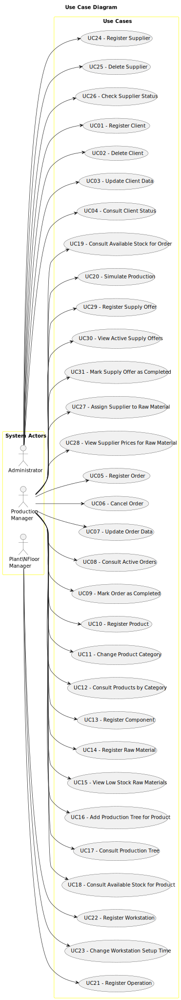

# Use Case Diagram (UCD)

# Use Cases / User Stories

| UC/US | Description                                                                             |                   
|:------|:----------------------------------------------------------------------------------------| 
| US01  | **As an Administrator, I want to register a client, so that they can place orders in the system.** |                   
| US02  | **As an Administrator, I want to delete a client, so that outdated or incorrect client records can be removed.** |                   
| US03  | **As an Administrator, I want to update client data, so that their information remains accurate.** |                   
| US04  | **As an Administrator, I want to consult the status of clients, so that I can verify their activity in the system.** |                   
| US05  | **As a Production Manager, I want to register an order, so that production can be planned accordingly.** |                   
| US06  | **As a Production Manager, I want to cancel an order, so that unnecessary production does not take place.** |                   
| US07  | **As a Production Manager, I want to update order data, so that changes in requirements can be reflected.** |                   
| US08  | **As a Production Manager, I want to consult active orders, so that I can track ongoing production.** |                   
| US09  | **As a Production Manager, I want to mark an order as completed, so that it is correctly reflected in the system.** |                   
| US10  | **As a Production Manager, I want to register a product, so that it can be used in production orders.** |                   
| US11  | **As a Production Manager, I want to change the category of a product, so that it is properly classified.** |                   
| US12  | **As a Production Manager, I want to consult products by category, so that I can easily find relevant products.** |                   
| US13  | **As a Production Manager, I want to register a component, so that it can be used in product manufacturing.** |                   
| US14  | **As a Production Manager, I want to register a raw material, so that it can be used in production.** |                   
| US15  | **As a Production Manager, I want to view raw materials that are low in stock, so that I can take necessary actions.** |                   
| US16  | **As a Production Manager, I want to add a production tree for a product, so that the required steps are defined.** |                   
| US17  | **As a Production Manager, I want to consult the production tree for a product, so that I can understand its manufacturing process.** |                   
| US18  | **As a Production Manager, I want to consult if there is available stock for the production of a product, so that I can ensure sufficient materials before starting production.** |                   
| US19  | **As a Production Manager, I want to consult if there is available stock for the production of an order, so that I can confirm material availability for multiple products simultaneously.** |                   
| US20  | **As a Production Manager, I want to simulate the production of a product, so that I can identify potential issues before actual production begins.** |                   
| US22  | **As a Plant Floor Manager, I want to register an operation, so that it can be assigned to workstations.** |                   
| US23  | **As a Plant Floor Manager, I want to register a workstation, so that production tasks can be assigned to specific machines.** |                   
| US24  | **As a Plant Floor Manager, I want to change the setup time of a workstation for a specific operation, so that scheduling is optimized.** |                   
| US25  | **As an Administrator, I want to register a supplier, so that raw materials can be sourced efficiently.** |                   
| US26  | **As an Administrator, I want to delete a supplier, so that outdated supplier records do not clutter the system.** |                   
| US27  | **As an Administrator, I want to check the status of suppliers, so that I can ensure business continuity.** |                   
| US28  | **As a Production Manager, I want to assign a supplier to a raw material, so that sourcing is correctly documented.** |                   
| US29  | **As a Production Manager, I want to view supplier prices for a raw material, so that I can choose the best option.** |                   
| US30  | **As a Production Manager, I want to register a supply offer, so that incoming stock is properly managed.** |                   
| US31  | **As a Production Manager, I want to view active supply offers, so that I can track pending deliveries.** |                   
| US32  | **As a Production Manager, I want to mark a supply offer as completed, so that it is correctly recorded in the system.** |                   
