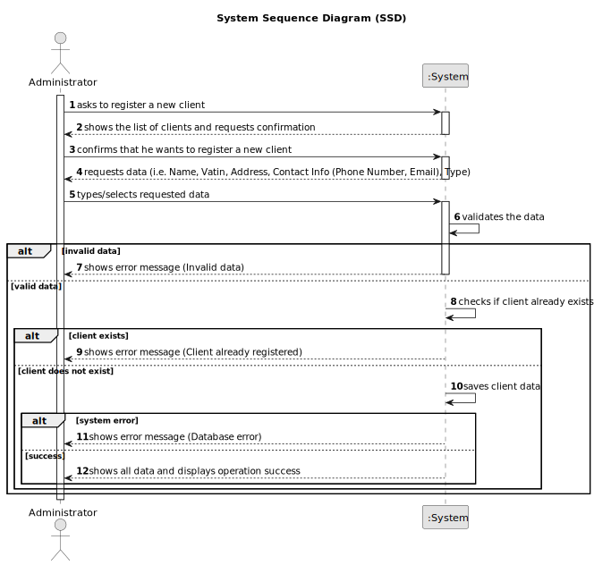

# US001 - Register a Client

## 1. Requirements Engineering

### 1.1. User Story Description

As an Administrator, I want to register a client, so that they can place orders in the system.

### 1.2. Customer Specifications and Clarifications

**From the specifications document:**

>   The administrator must fill in all the fields for client registration.

>	Each client is characterized by having a unique ID, a name, an address, a type of identification document (vatin), two contact details (phone number and email), and a company type.

>	The company type associated with the client can be either individual or company.

### 1.3. Acceptance Criteria

* **AC01:** Client ID, Name, Address, Contact Info (Phone Number and Email), VATIN, and Company Type must be provided by the Administrator.
* **AC02:** All mandatory fields must be filled in.
* **AC03:** System must ensure that the client’s ID is unique.
* **AC04:** Phone number must contain exactly 9 digits.
* **AC05:** Email must contain a prefix before the "@" symbol and a domain after it.
* **AC06:** Address must include a street, zip code (in the format "xxxx-xxx"), town, and country.
* **AC07:** Company type must be selected from a predefined list (Individual or Company).
* **AC08:** System should ensure only authorized administrators can register clients.

### 1.4. Found out Dependencies

* No dependencies.

### 1.5 Input and Output Data

**Input Data:**

* Typed data:
  * ID
  * Name
  * Vatin
  * Street
  * Zip Code
  * Town
  * Country
  * Phone Number
  * Email

* Selected data:
  * Company Type

**Output Data:**

* All data of the new registered collaborator
* (In)Success of the operation

### 1.6. System Sequence Diagram (SSD)

### 1.7 Other Relevant Remarks

* n/a