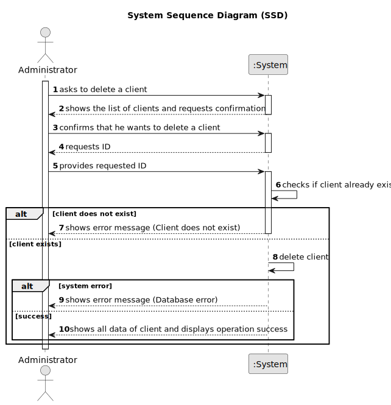

# US002 - Delete a Client

## 1. Requirements Engineering

### 1.1. User Story Description

As an Administrator, I want to delete a client, so that outdated or incorrect client records can be removed.

### 1.2. Customer Specifications and Clarifications

**From the specifications document:**

>   The administrator must be able to delete client records from the system if the client is no longer valid or the information is incorrect.

>	Deleting a client should remove all associated data (such as orders).

### 1.3. Acceptance Criteria

* **AC01:** System should ensure that the client ID is valid before attempting deletion.
* **AC02:** Once deleted, the client’s record should be removed from the system, including associated data.

### 1.4. Found out Dependencies

* There is a dependency on "US001 - Register a Client" as the client must be registered before he can be deleted.

### 1.5 Input and Output Data

**Input Data:**

* Typed data:
  * Client ID

**Output Data:**
  * List of clients
  * (In)Success of the operation
  * All data of the new deleted client

### 1.6. System Sequence Diagram (SSD)

### 1.7 Other Relevant Remarks

* n/a