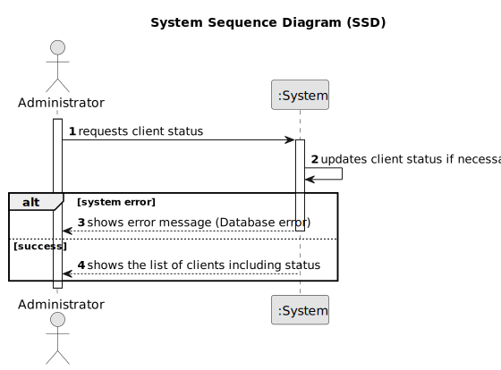

# US004 - Consult Client Status

## 1. Requirements Engineering

### 1.1. User Story Description

As an Administrator, I want to consult the status of clients, so that I can verify their activity in the system.

### 1.2. Customer Specifications and Clarifications

**From the specifications document:**

>   The administrator must be able to view all relevant client information, including their activity status in the system.

>	Each client is characterized by its status, which can be Active or Inactive depending on whether it has orders to receive.

### 1.3. Acceptance Criteria

* **AC01:** The system must display all client information, including ID, Name, VATIN and Activity Status.
* **AC02:** Activity status must indicate whether the client is active or inactive.
* **AC03:** Activity status must automatically update based on the presence of active orders. If a client has active orders (orders with a delivery date in the future), their status must be set to Active, otherwise, it must be set to Inactive.

### 1.4. Found out Dependencies

* There is a dependency on "US001 - Register a client" as the client must be registered before their status can be consulted.

### 1.5 Input and Output Data

**Output Data:**

* List of clients

### 1.6. System Sequence Diagram (SSD)

### 1.7 Other Relevant Remarks

* n/a