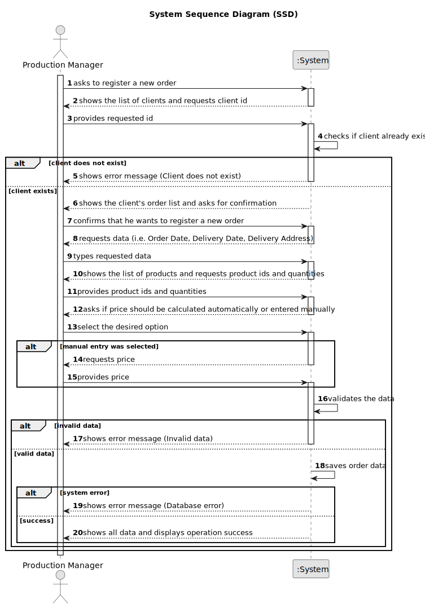

# US005 - Register an Order

## 1. Requirements Engineering

### 1.1. User Story Description

As a Production Manager, I want to register an order, so that production can be planned accordingly.

### 1.2. Customer Specifications and Clarifications

**From the specifications document:**

>   The production manager must fill in all the fields for order registration.

>	Each order is characterized by having a unique ID, a client, a list of products with respective quantities, an order date, a delivery date, a delivery address and the price.

>	The order price can be entered manually or calculated automatically depending on the price of the products ordered.

### 1.3. Acceptance Criteria

* **AC01:** Order ID, Client, List of Products with Quantities, Order Date, Delivery Date, Delivery Address, and Price must be provided by the Production Manager.
* **AC02:** All mandatory fields must be filled in.
* **AC03:** System must ensure that the order’s ID is unique.
* **AC04:** Client must correspond to an existing registered client.
* **AC05:** Delivery date must be later than the order date.
* **AC06:** The list of products must include at least one product with a valid quantity.
* **AC07:** All products included in the order must already be registered in the system.
* **AC08:** Address must include a street, zip code (in the format "xxxx-xxx"), town, and country.
* **AC09:** The order price can be entered manually or calculated automatically based on product prices.

### 1.4. Found out Dependencies

* There is a dependency on "US001 - Register a Client" as the client must be registered before an order can be created.
* There is a dependency on "US010 - Register a Product" as all products included in the order must be previously registered in the system.

### 1.5 Input and Output Data

**Input Data:**

* Typed data:
  * ID
  * Client ID
  * Order Date
  * Delivery Date
  * Delivery Street
  * Delivery Zip Code
  * Delivery Town
  * Delivery Country
  * Price (optional)
  * List of Product IDs with Quantities

**Output Data:**

* List of clients
* List of Products
* (In)Success of the operation
* All data of the new registered order

### 1.6. System Sequence Diagram (SSD)

### 1.7 Other Relevant Remarks

* n/a