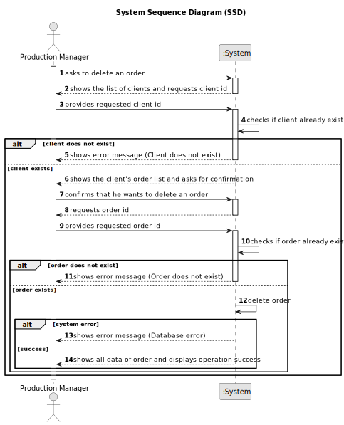

# US006 - Cancel an Order

## 1. Requirements Engineering

### 1.1. User Story Description

As a Production Manager, I want to cancel an order, so that unnecessary production does not take place.

### 1.2. Customer Specifications and Clarifications

**From the specifications document:**

>   The production manager must be able to delete order records from the system if the order is no longer valid or the information is incorrect.

### 1.3. Acceptance Criteria

* **AC01:** System should ensure that the order ID is valid before attempting deletion.
* **AC02:** Once deleted, the order’s record should be removed from the system, including associated data.

### 1.4. Found out Dependencies

* There is a dependency on "US005 - Register an Order"  as the order must be registered before it can be deleted.

### 1.5 Input and Output Data

**Input Data:**

* Typed data:
  * Client ID
  * Order ID

**Output Data:**

  * List of clients
  * (In)Success of the operation
  * All data of the new deleted order

### 1.6. System Sequence Diagram (SSD)

### 1.7 Other Relevant Remarks

* n/a