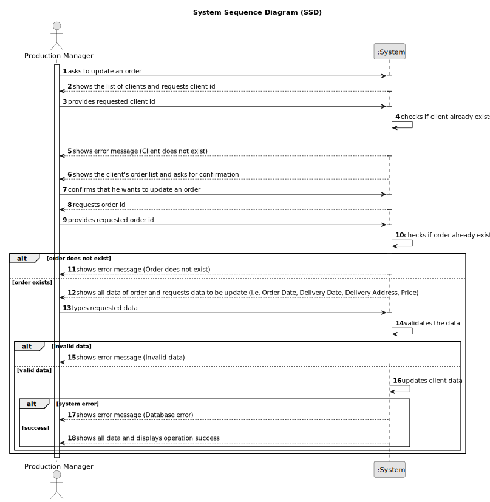

# US007 - Update Order Data

## 1. Requirements Engineering

### 1.1. User Story Description

As a Production Manager, I want to update order data, so that changes in requirements can be reflected..

### 1.2. Customer Specifications and Clarifications

**From the specifications document:**

>   The Production Manager must be able to modify all order fields except the ID.

>	Each order is characterized by having a unique ID, a client, a list of products with respective quantities, an order date, a delivery date, a delivery address and the price.

### 1.3. Acceptance Criteria

* **AC01:** The system must ensure that the order ID is valid before attempting to update it.
* **AC02:** Order ID cannot be modified.
* **AC03:** Production Manager must be able to update Order Date, Delivery Date, Delivery Address, and Price.
* **AC04:** Delivery date must be later than the order date.
* **AC05:** Address must include a street, zip code (in the format "xxxx-xxx"), town, and country.

### 1.4. Found out Dependencies

* There is a dependency on "US005 - Register an Order"  as the order must be registered before it can be updated.

### 1.5 Input and Output Data

**Input Data:**

* Typed data:
  * Client ID
  * Order ID
  * Order Date
  * Delivery Date
  * Delivery Street
  * Delivery Zip Code
  * Delivery Town
  * Delivery Country
  * Price

**Output Data:**

* List of clients
* List of orders
* (In)Success of the operation
* Updated order data

### 1.6. System Sequence Diagram (SSD)

### 1.7 Other Relevant Remarks

* n/a