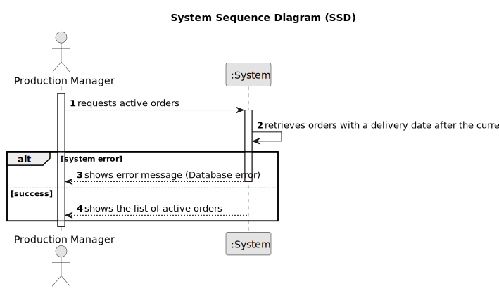

# US008 - Consult Active Orders

## 1. Requirements Engineering

### 1.1. User Story Description

As a Production Manager, I want to consult active orders, so that I can track ongoing production.

### 1.2. Customer Specifications and Clarifications

**From the specifications document:**

>   An active order is an order whose delivery data has not yet been reached, i.e. whose delivery data is later than the current data.

>   The Production Manager must be able to view all relevant order information.

### 1.3. Acceptance Criteria

* **AC01:** The system must display all order information.
* **AC02:** The system must consider an order as active if its delivery date is after the current date.

### 1.4. Found out Dependencies

* There is a dependency on "US005 - Register an Order"  as the order must be registered before it can be updated.

### 1.5 Input and Output Data

**Output Data:**

* List of orders

### 1.6. System Sequence Diagram (SSD)

### 1.7 Other Relevant Remarks

* n/a