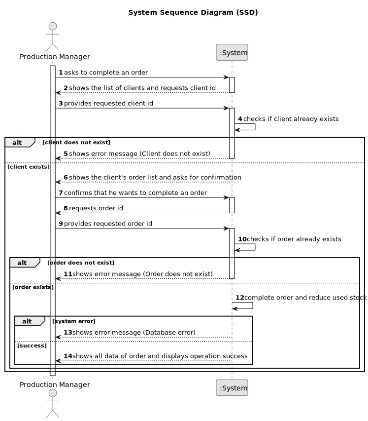

# US009 - Complete an Order

## 1. Requirements Engineering

### 1.1. User Story Description

As a Production Manager, I want to mark an order as completed, so that it is correctly reflected in the system.

### 1.2. Customer Specifications and Clarifications

**From the specifications document:**

>   The production manager must be able to mark an order as completed, ensuring that the necessary raw materials are deducted from stock.

### 1.3. Acceptance Criteria

* **AC01:** System should ensure that the order ID is valid before attempting deletion.
* **AC02:** Once completed, the order’s record should be updated in the system, and all associated stock of raw materials used must be deducted accordingly.
* **AC03:** If there is insufficient stock to complete the order, the system should prevent completion and notify the user.

### 1.4. Found out Dependencies

* There is a dependency on "US005 - Register an Order"  as the order must be registered before it can be completed.

### 1.5 Input and Output Data

**Input Data:**

* Typed data:
  * Client ID
  * Order ID

**Output Data:**

  * List of clients
  * (In)Success of the operation
  * All data of the new completed order

### 1.6. System Sequence Diagram (SSD)

### 1.7 Other Relevant Remarks

* n/a