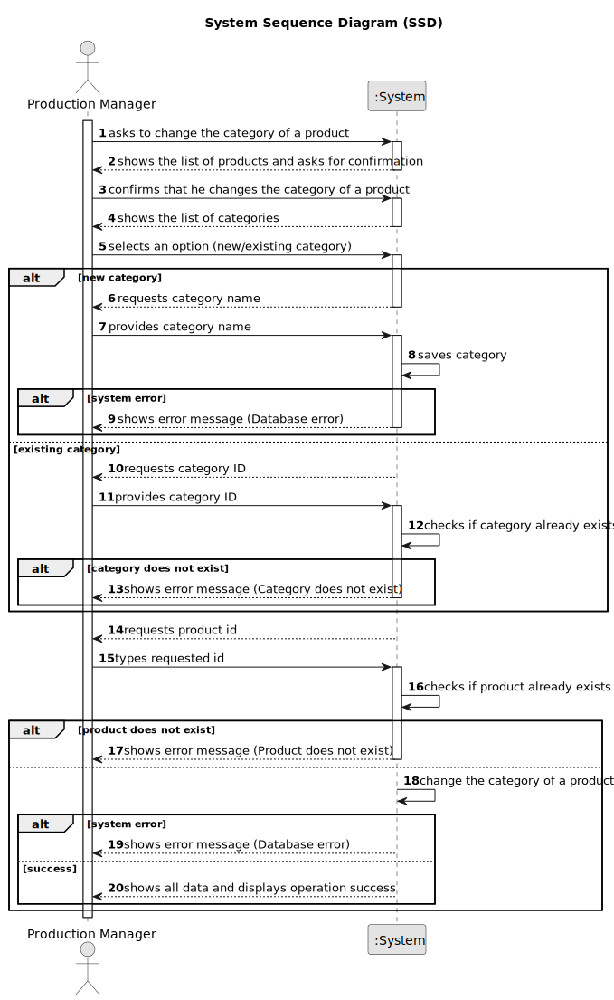

# US011 - Change Product Category

## 1. Requirements Engineering

### 1.1. User Story Description

As a Production Manager, I want to change the category of a product, so that it is properly classified.

### 1.2. Customer Specifications and Clarifications

**From the specifications document:**

>   The Production Manager must have the ability to change the category of an existing product.

>	A product's category should be updated while ensuring it remains consistent with the available categories in the system.

>   The updated category must be valid and must already exist in the system.

### 1.3. Acceptance Criteria

* **AC01:** The Production Manager must be able to select a product and change its category.
* **AC02:** Category must either already exist in the system or be provided during changed.

### 1.4. Found out Dependencies

* There is a dependency on "US010 - Register a Product" as the product must be registered before it can be changed.

### 1.5 Input and Output Data

**Input Data:**

* Typed data:
  * Product ID
  * Category

**Output Data:**

* List of products
* List of categories
* (In)Success of the operation
* All data of the product

### 1.6. System Sequence Diagram (SSD)

### 1.7 Other Relevant Remarks

* n/a