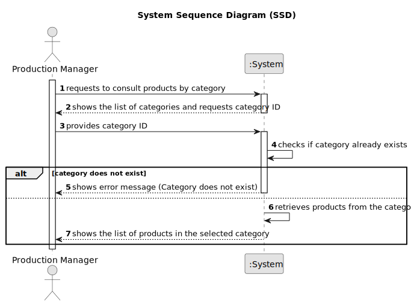

# US012 - Consult Products by Category

## 1. Requirements Engineering

### 1.1. User Story Description

As a Production Manager, I want to consult products by category, so that I can easily find relevant products.

### 1.2. Customer Specifications and Clarifications

**From the specifications document:**

>   The production manager must be able to search for products based on their category.

>	Each product is characterized by having a unique ID, a name, a description, a category, a capacity, a size, a color and the price.

>   The product category must already exist in the system to be used as a filter for product consultation.

### 1.3. Acceptance Criteria

* **AC01:** The system must allow searching for products using an existing category.
* **AC02:** The system must display the following product attributes: ID, Name, Description, Category, Capacity, Size, Color, and Price.

### 1.4. Found out Dependencies

* There is a dependency on "US010 - Register a Product" as the product must be registered before it can be changed.

### 1.5 Input and Output Data

**Input Data:**

* Typed data:
  * Product Category ID

**Output Data:**

* List of categories
* List of products that match the selected category

### 1.6. System Sequence Diagram (SSD)

### 1.7 Other Relevant Remarks

* n/a