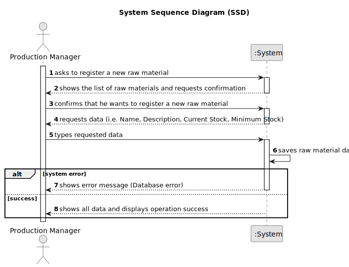

# US014 - Register a Raw Material

## 1. Requirements Engineering

### 1.1. User Story Description

As a Production Manager, I want to register a raw material, so that it can be used in production.

### 1.2. Customer Specifications and Clarifications

**From the specifications document:**

>   The production manager must fill in all the fields for raw material registration.

>	Each raw material is characterized by having a unique ID, a name, a description, a current stock and the minimum stock.

### 1.3. Acceptance Criteria

* **AC01:** Component ID, Name, Description, Current Stock and Minimum Stock must be provided by the Production Manager.
* **AC02:** All mandatory fields must be filled in.
* **AC03:** System must ensure that the raw material’s ID is unique.

### 1.4. Found out Dependencies

* No dependencies.

### 1.5 Input and Output Data

**Input Data:**

* Typed data:
  * Raw Material ID
  * Name
  * Description
  * Current stock
  * Minimum stock

**Output Data:**

* List of raw materials
* (In)Success of the operation
* All data of the new registered raw material

### 1.6. System Sequence Diagram (SSD)

### 1.7 Other Relevant Remarks

* n/a