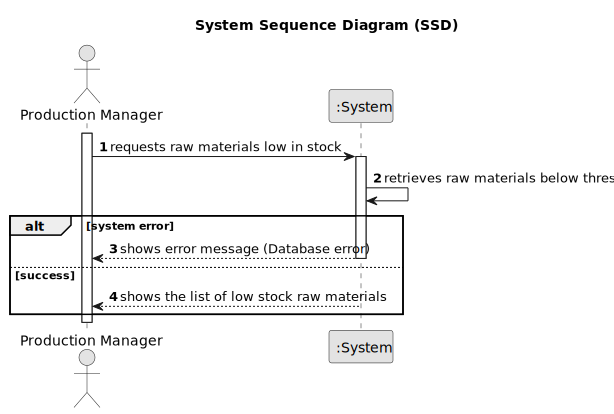

# US015 - View Low Stock Raw Materials

## 1. Requirements Engineering

### 1.1. User Story Description

As a Production Manager, I want to view raw materials that are low in stock, so that I can take necessary actions.

### 1.2. Customer Specifications and Clarifications

**From the specifications document:**

>   A raw material is considered to be in low stock when its minimum stock is greater than the current stock.

>	The system must provide a list of all raw materials that are in low stock.

### 1.3. Acceptance Criteria

* **AC01:** The system must compare each raw material’s current stock with its minimum stock.
* **AC02:** If the current stock is lower than the minimum stock, the raw material must be included in the low stock list.
* **AC03:** The system must display the list of raw materials that are low in stock.

### 1.4. Found out Dependencies

* No dependencies.

### 1.5 Input and Output Data

**Output Data:**

* List of raw materials that are in low stock

### 1.6. System Sequence Diagram (SSD)

### 1.7 Other Relevant Remarks

* n/a