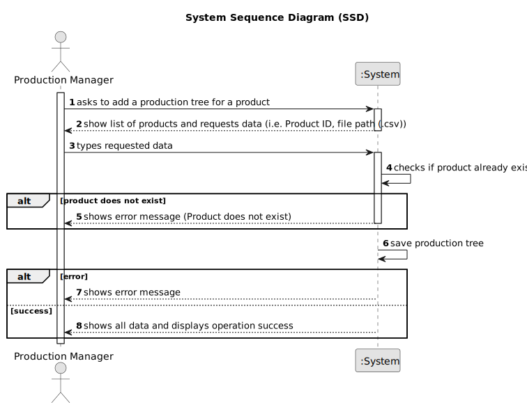

# US016 - Add a Production Tree for a Product

## 1. Requirements Engineering

### 1.1. User Story Description

As a Production Manager, I want to add a production tree for a product, so that the required steps are defined

### 1.2. Customer Specifications and Clarifications

**From the specifications document:**

>   The production manager must define all steps required to manufacture a product.

>	Each product’s production tree consists of multiple components, each with an associated quantity, operation, and sequence order.

>   The system must ensure that the production tree is structured hierarchically, allowing dependencies between components and raw materials.

### 1.3. Acceptance Criteria

* **AC01:** The Production Manager must provide the product ID for which the production tree is being added.
* **AC02:** The system must validate that the production tree follows a logical hierarchical structure.

### 1.4 Input and Output Data

**Input Data:**

* Typed data:
  * Product ID
  * File Path

**Output Data:**

* (In)Success of the operation

### 1.5. System Sequence Diagram (SSD)

### 1.6 Other Relevant Remarks

* n/a