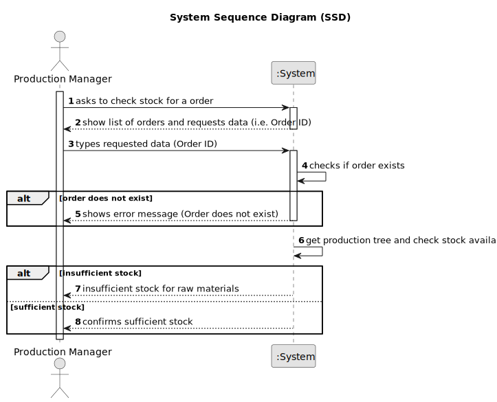

# US019 - Check Has Sufficient Stock for Order

## 1. Requirements Engineering

### 1.1. User Story Description

As a Production Manager, I want to consult if there is available stock for the production of an order, so that I can confirm material availability for multiple products simultaneously.

### 1.2. Customer Specifications and Clarifications

**From the specifications document:**

>   The production manager must define all steps required to manufacture a product.

>	Each product’s production tree consists of multiple components, each with an associated quantity, operation, and sequence order.

>   The system must ensure that the production tree is structured hierarchically, allowing dependencies between components and raw materials.

### 1.3. Acceptance Criteria

* **AC01:** The Production Manager must provide the order ID for which the stock availability will be checked.
* **AC02:** The system must check if there is sufficient stock available for each component in the production tree based on the required quantity.

### 1.4 Input and Output Data

**Input Data:**

* Typed data:
  * Order ID

**Output Data:**

* Raw Materials without sufficient stock

### 1.5. System Sequence Diagram (SSD)

### 1.6 Other Relevant Remarks

* n/a