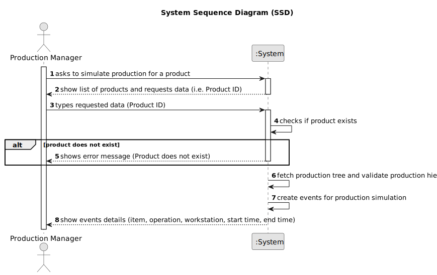

# US020 - Simulate the Production of a Product

## 1. Requirements Engineering

### 1.1. User Story Description

As a Production Manager, I want to simulate the production of a product, so that I can identify potential issues before actual production begins.

### 1.2. Customer Specifications and Clarifications

**From the specifications document:**

>   The production manager must define all steps required to manufacture a product.

>	Each product’s production tree consists of multiple components, each with an associated quantity, operation, and sequence order.

>   The simulation will include events that track the following information for each operation: item, operation, workstation, and duration (start and end times).

>   The system should prioritize the fastest available workstation for each operation to optimize production time.

>   The production tree must be respected hierarchically, meaning that the order of item production must follow the structure defined in the production tree.

### 1.3. Acceptance Criteria

* **AC01:** The Production Manager must provide the product ID for which the production simulation will be executed.
* **AC02:** The system must generate a simulation sequence consisting of events, each containing an item, operation, workstation, and duration.
* **AC03:** The simulation must ensure that the fastest available workstation is selected for each operation.
* **AC04:** The system must validate that the production follows the hierarchical order of items as defined in the production tree.

### 1.4 Input and Output Data

**Input Data:**

* Typed data:
  * Product ID

**Output Data:**

* Production Simulation Events (each event containing: item, operation, workstation, start time, end time)

### 1.5. System Sequence Diagram (SSD)

### 1.6 Other Relevant Remarks

* n/a