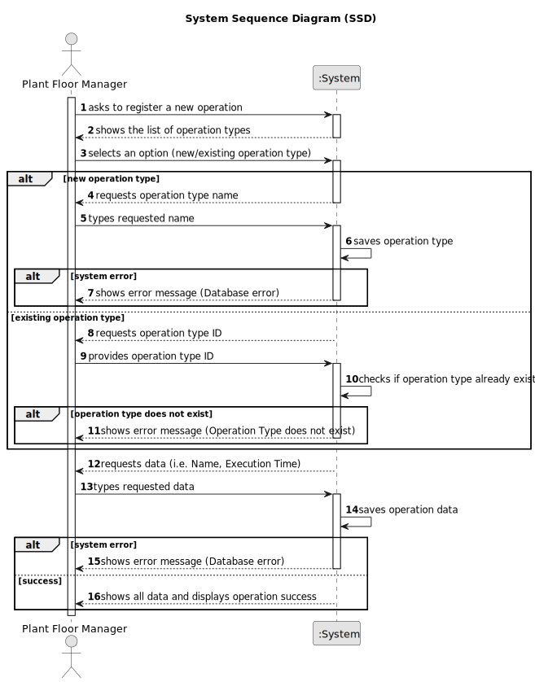

# US022 - Register an Operation

## 1. Requirements Engineering

### 1.1. User Story Description

As a Plant Floor Manager, I want to register an operation, so that it can be assigned to workstations.

### 1.2. Customer Specifications and Clarifications

**From the specifications document:**

>   The Plant Floor Manager must fill in all the fields for operation registration.

>	Each operation is characterized by having a unique ID, a name, a type and the execution time.

>   The operation type can be registered at the time of operation registration or already contained in the system.

### 1.3. Acceptance Criteria

* **AC01:** Operation ID, Name, Type and Execution Time must be provided by the Plant Floor Manager.
* **AC02:** All mandatory fields must be filled in.
* **AC03:** System must ensure that the operation’s ID is unique.
* **AC04:** Operation Type must either already exist in the system or be provided during registration.
* **AC05:** Execution Time must be positive values.

### 1.4. Found out Dependencies

* No dependencies.

### 1.5 Input and Output Data

**Input Data:**

* Typed data:
  * Operation ID
  * Name
  * Operation Type
  * Execution Time

**Output Data:**

* List of operation types
* (In)Success of the operation
* All data of the new registered operation

### 1.6. System Sequence Diagram (SSD)

### 1.7 Other Relevant Remarks

* n/a