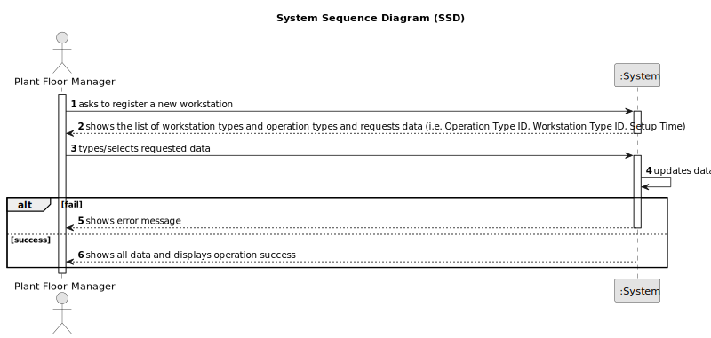

# US024 - Change Workstation Setup Time

## 1. Requirements Engineering

### 1.1. User Story Description

AAs a Plant Floor Manager, I want to change the setup time of a workstation for a specific operation, so that scheduling is optimized.

### 1.2. Customer Specifications and Clarifications

**From the specifications document:**

>   The Plant Floor Manager must be able to modify the setup time of a workstation for a specific operation.

>	The system must ensure that the new setup time is applied only to the specified operation and workstation.

### 1.3. Acceptance Criteria

* **AC01:** The workstation must be registered in the system.
* **AC02:** The operation must be registered in the system.
* **AC03:** The new setup time must be a positive value.

### 1.4. Found out Dependencies

* There is a dependency on "US022 - Register an Operation" as the operation must be registered.
* There is a dependency on "US023 - Register a Workstation" as the workstation must be registered.

### 1.5 Input and Output Data

**Input Data:**

* Typed data:
  * Workstation Type ID
  * Operation Type ID
  * Setup Time

**Output Data:**

* List of workstation types
* List of operation types
* (In)Success of the operation
* All data

### 1.6. System Sequence Diagram (SSD)

### 1.7 Other Relevant Remarks

* n/a