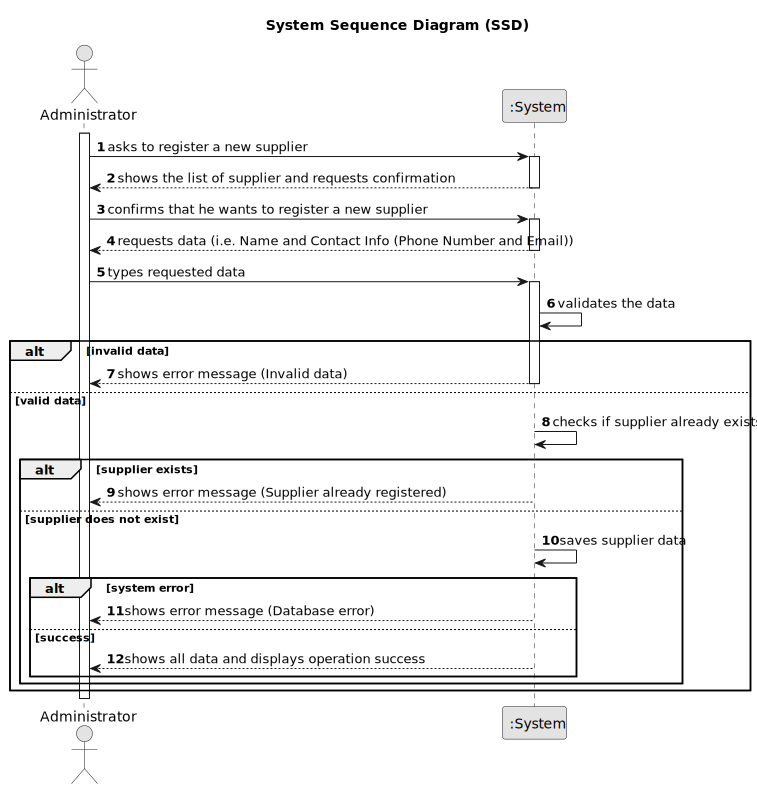

# US025 - Register a Supplier

## 1. Requirements Engineering

### 1.1. User Story Description

As an Administrator, I want to register a supplier, so that raw materials can be sourced efficiently.

### 1.2. Customer Specifications and Clarifications

**From the specifications document:**

>   The administrator must fill in all the fields for supplier registration.

>	Each supplier is characterized by having a unique ID, a name, a phone number and the email.

### 1.3. Acceptance Criteria

* **AC01:** Supplier ID, Name and Contact Info (Phone Number and Email) must be provided by the Administrator.
* **AC02:** All mandatory fields must be filled in.
* **AC03:** System must ensure that the supplier’s ID is unique.
* **AC04:** Phone number must contain exactly 9 digits.
* **AC05:** Email must contain a prefix before the "@" symbol and a domain after it.

### 1.4. Found out Dependencies

* No dependencies.

### 1.5 Input and Output Data

**Input Data:**

* Typed data:
  * ID
  * Name
  * Phone Number
  * Email

**Output Data:**

* List of suppliers
* (In)Success of the operation
* All data of the new registered supplier

### 1.6. System Sequence Diagram (SSD)

### 1.7 Other Relevant Remarks

* n/a