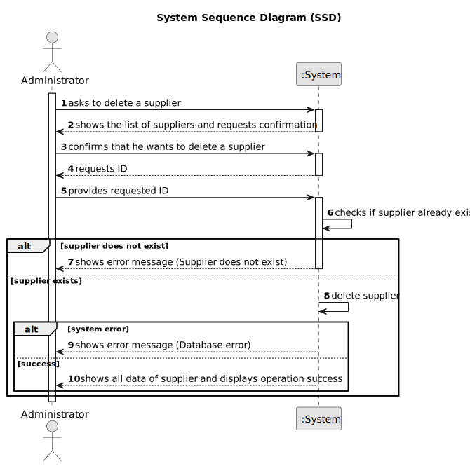

# US026 - Delete a Supplier

## 1. Requirements Engineering

### 1.1. User Story Description

As an Administrator, I want to delete a supplier, so that outdated supplier records do not clutter the system.

### 1.2. Customer Specifications and Clarifications

**From the specifications document:**

>   The administrator must be able to delete supplier records from the system if the supplier is no longer valid or the information is incorrect.

>	Deleting a supplier should remove all associated data (such as supply offers).

### 1.3. Acceptance Criteria

* **AC01:** System should ensure that the supplier ID is valid before attempting deletion.
* **AC02:** Once deleted, the supplier’s record should be removed from the system, including associated data.

### 1.4. Found out Dependencies

* There is a dependency on "US025 - Register a Supplier" as the supplier must be registered before it can be deleted.

### 1.5 Input and Output Data

**Input Data:**

* Typed data:
  * Supplier ID

**Output Data:**

* List of suppliers
* (In)Success of the operation
* All data of the new deleted supplier

### 1.6. System Sequence Diagram (SSD)

### 1.7 Other Relevant Remarks

* n/a