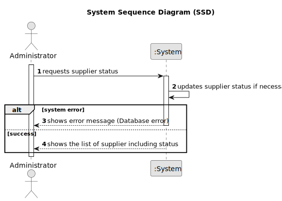

# US027 - Consult Supplier Status

## 1. Requirements Engineering

### 1.1. User Story Description

As an Administrator, I want to consult the status of suppliers, so that I can ensure business continuity.

### 1.2. Customer Specifications and Clarifications

**From the specifications document:**

>   The administrator must be able to view all relevant supplier information, including their activity status in the system.

>	Each supplier is characterized by its status, which can be Active or Inactive depending on whether it has supply offers to receive.

### 1.3. Acceptance Criteria

* **AC01:** The system must display all supplier information, including ID, Name and Activity Status.
* **AC02:** Activity status must indicate whether the supplier is active or inactive.
* **AC03:** Activity status must automatically update based on the presence of active supply offers. If a supplier has active supply offers (supply offers with a delivery date in the future), their status must be set to Active, otherwise, it must be set to Inactive.

### 1.4. Found out Dependencies

* There is a dependency on "US025 - Register a supplier" as the supplier must be registered before their status can be consulted.

### 1.5 Input and Output Data

**Output Data:**

* List of suppliers

### 1.6. System Sequence Diagram (SSD)

### 1.7 Other Relevant Remarks

* n/a