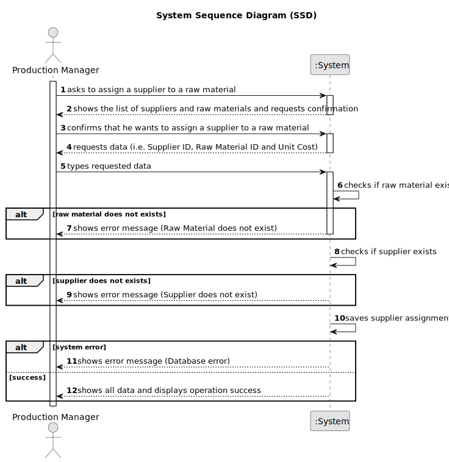

# US028 - Assign a Supplier to a Raw Material

## 1. Requirements Engineering

### 1.1. User Story Description

As a Production Manager, I want to assign a supplier to a raw material, so that sourcing is correctly documented.

### 1.2. Customer Specifications and Clarifications

**From the specifications document:**

>   The Production Manager must be able to assign a supplier to a raw material.

>	Each assignment must include a valid supplier ID, a valid raw material ID and a unit cost.

### 1.3. Acceptance Criteria

* **AC01:** Can only be assigned if both the supplier and raw material exist in the system.
* **AC02:** Unit Cost must be positive values.

### 1.4. Found out Dependencies

* There is a dependency on "US025 - Register a Supplier" as the supplier must be registered.
* There is a dependency on "US014 - Register a Raw Material" as the raw material must be registered.

### 1.5 Input and Output Data

**Input Data:**

* Typed data:
  * Supplier ID
  * Raw Material ID
  * Unit Cost

**Output Data:**

* List of raw materials
* List of suppliers
* (In)Success of the operation
* All data of the raw material

### 1.6. System Sequence Diagram (SSD)

### 1.7 Other Relevant Remarks

* n/a