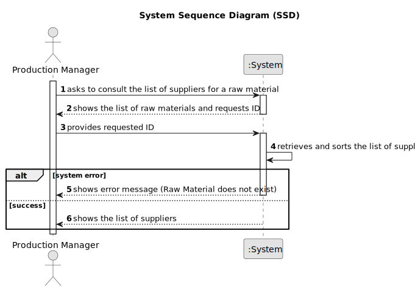

# US029 - Consult prices of Suppliers for a Raw Material

## 1. Requirements Engineering

### 1.1. User Story Description

As a Production Manager, I want to view supplier prices for a raw material, so that I can choose the best option.

### 1.2. Customer Specifications and Clarifications

**From the specifications document:**

>	The list of suppliers must be sorted by price in ascending order.

### 1.3. Acceptance Criteria

* **AC01:** Can only be consulted if raw material exist in the system.
* **AC02:** The list of suppliers must be displayed in ascending order of unit cost.

### 1.4. Found out Dependencies

* There is a dependency on "US028 - Assign a Supplier to a Raw Material" as the supplier must be assigned.

### 1.5 Input and Output Data

**Input Data:**

* Typed data:
  * Raw Material ID

**Output Data:**

* Sorted list of suppliers

### 1.6. System Sequence Diagram (SSD)

### 1.7 Other Relevant Remarks

* n/a