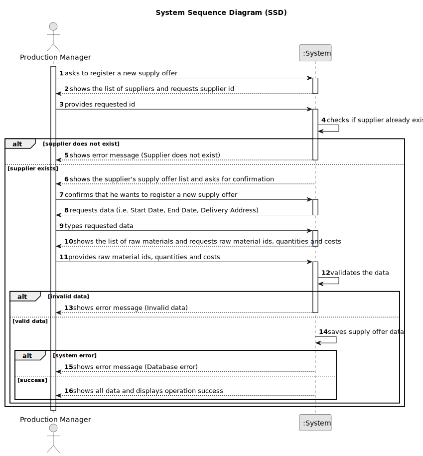

# US030 - Register a Supply Offer

## 1. Requirements Engineering

### 1.1. User Story Description

As a Production Manager, I want to register a supply offer, so that incoming stock is properly managed.

### 1.2. Customer Specifications and Clarifications

**From the specifications document:**

>   The production manager must fill in all the fields for supply offer registration.

>	Each supply offer is characterized by having a unique ID, a supplier, a list of raw materials with respective quantities and costs, an start date, a end date and the delivery address.

### 1.3. Acceptance Criteria

* **AC01:** Supply Offer ID, Supplier, List of Raw Materials with Quantities and Costs, Start Date, End Date and Delivery Address must be provided by the Production Manager.
* **AC02:** All mandatory fields must be filled in.
* **AC03:** System must ensure that the supply offer’s ID is unique.
* **AC04:** Supplier must correspond to an existing registered supplier.
* **AC05:** Start date must be later than the end date.
* **AC06:** The list of raw materials must include at least one raw materials with a valid quantity and cost.
* **AC07:** All raw materials included in the supply offer must already be registered in the system.
* **AC08:** Address must include a street, zip code (in the format "xxxx-xxx"), town, and country.

### 1.4. Found out Dependencies

* There is a dependency on "US025 - Register a Supplier" as the supplier must be registered before a supply offer can be created.
* There is a dependency on "US014 - Register a Raw Material" as all raw materials included in the supply offer must be previously registered in the system.

### 1.5 Input and Output Data

**Input Data:**

* Typed data:
  * ID
  * Supplier ID
  * Start Date
  * End Date
  * Delivery Street
  * Delivery Zip Code
  * Delivery Town
  * Delivery Country
  * List of Raw Material IDs with Quantities and Costs

**Output Data:**

* List of suppliers
* List of raw materials
* (In)Success of the operation
* All data of the new registered supply offer

### 1.6. System Sequence Diagram (SSD)

### 1.7 Other Relevant Remarks

* n/a