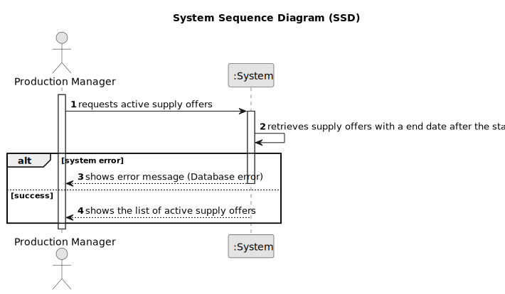

# US031 - Consult Active Supply Offers

## 1. Requirements Engineering

### 1.1. User Story Description

As a Production Manager, I want to view active supply offers, so that I can track pending deliveries.

### 1.2. Customer Specifications and Clarifications

**From the specifications document:**

>   An active supply offer is an supply offer whose end data has not yet been reached, i.e. whose end date is later than the start date.

>   The Production Manager must be able to view all relevant supply offer information.

### 1.3. Acceptance Criteria

* **AC01:** The system must display all supply offer information.
* **AC02:** The system must consider an supply offer as active if its end date is after the start date.

### 1.4. Found out Dependencies

* There is a dependency on "US030 - Register a Supply Offer"  as the supply offer must be registered.

### 1.5 Input and Output Data

**Output Data:**

* List of supply offers

### 1.6. System Sequence Diagram (SSD)

### 1.7 Other Relevant Remarks

* n/a