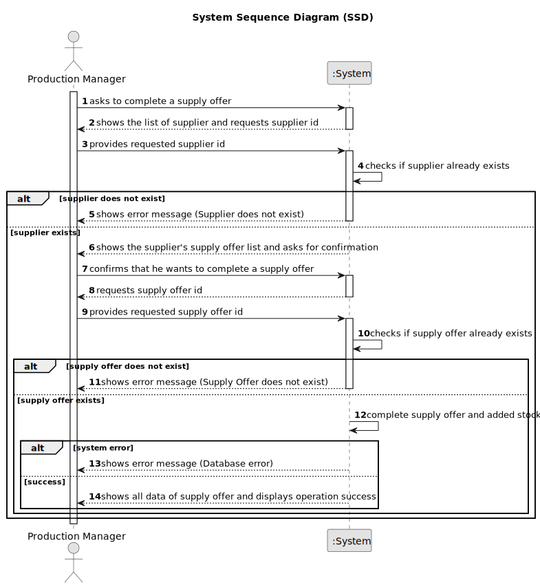

# US032 - Complete a Supply Offer

## 1. Requirements Engineering

### 1.1. User Story Description

As a Production Manager, I want to mark a supply offer as completed, so that it is correctly recorded in the system.

### 1.2. Customer Specifications and Clarifications

**From the specifications document:**

>   The production manager must be able to mark an supply offer as completed, ensuring that the necessary raw materials are added from stock.

### 1.3. Acceptance Criteria

* **AC01:** System should ensure that the supply offer ID is valid before attempting deletion.
* **AC02:** Once completed, the supply offer’s record should be updated in the system, and all associated stock of raw materials used must be added accordingly.

### 1.4. Found out Dependencies

* There is a dependency on "US030 - Register a Supply Offer"  as the supply offer must be registered before it can be completed.

### 1.5 Input and Output Data

**Input Data:**

* Typed data:
  * Supplier ID
  * Supply Offer ID

**Output Data:**

  * List of supplier
  * (In)Success of the operation
  * All data of the new completed supply offer

### 1.6. System Sequence Diagram (SSD)

### 1.7 Other Relevant Remarks

* n/a